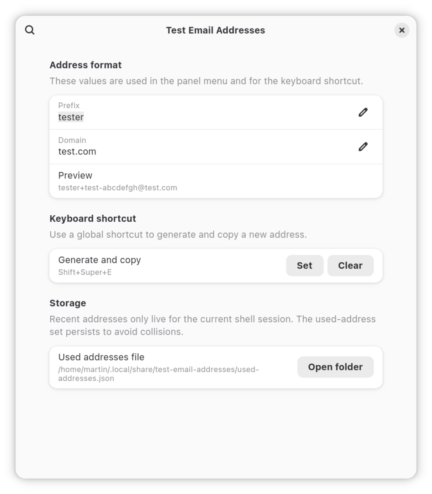

# Test Email Addresses

A GNOME Shell extension that generates unique test email addresses from the top bar and copies them to the clipboard.

It is meant for people who repeatedly fill sign-up, checkout, or QA forms and want disposable but traceable email aliases without typing them manually.

## Compatibility

- GNOME Shell 49
- GNOME Shell 50

## Screenshots

### Panel menu


### Preferences



Generated addresses use this format:

`<prefix>+test-<8 lowercase letters or numbers>@<domain>`

Example:

`tester+test-abcd0123@example.com`

## What it does

- Adds a top-bar menu for quick access
- Generates and copies a new address in one action
- Lets you configure the prefix and domain in Preferences
- Supports an optional keyboard shortcut for keyboard-only use
- Shows the 10 most recent generated addresses for the current session
- Keeps a local used-address set to avoid generating duplicates across sessions

## How to use it

1. Install and enable the extension.
2. Open the extension preferences and set the prefix, such as `tester`.
3. Set the domain, such as `example.com`.
4. Open the top-bar menu and click `Generate and copy`.
5. Paste the generated address into the form you are filling.
6. If needed, copy one of the recent addresses again from the history list.

If you prefer using only the keyboard, set a shortcut in Preferences and trigger address generation without opening the menu.

## Installation

### From GitHub Releases

Download the latest `test-email-addresses@dmferrari.github.io.shell-extension.zip` from the
[Releases page](https://github.com/dmferrari/email-addresses-generator/releases),
then install it with:

```sh
gnome-extensions install --force test-email-addresses@dmferrari.github.io.shell-extension.zip
gnome-extensions enable test-email-addresses@dmferrari.github.io
```

If GNOME Shell does not pick up the new version immediately, disable and enable it again:

```sh
gnome-extensions disable test-email-addresses@dmferrari.github.io
gnome-extensions enable test-email-addresses@dmferrari.github.io
```

### From the repository

For local development or manual installation from the working tree:

```sh
./dev-reload.sh
```

That copies the runtime files into `~/.local/share/gnome-shell/extensions/test-email-addresses@dmferrari.github.io/`,
compiles the schema, and reloads the extension.

## Data and storage

The extension stores its used-address set locally in:

`~/.local/share/test-email-addresses/used-addresses.json`

This is used only to avoid generating duplicate addresses.

The recent-history list shown in the panel menu is kept only for the current GNOME Shell session.

## Development

Run the tests:

```sh
./test.sh
```

Reload the extension into your local GNOME Shell user extensions directory:

```sh
./dev-reload.sh
```

Release process documentation is available in [docs/releasing.md](docs/releasing.md).

## Packaging

Build a release zip:

```sh
./package.sh
```

The archive is written to `dist/test-email-addresses@dmferrari.github.io.shell-extension.zip`.
